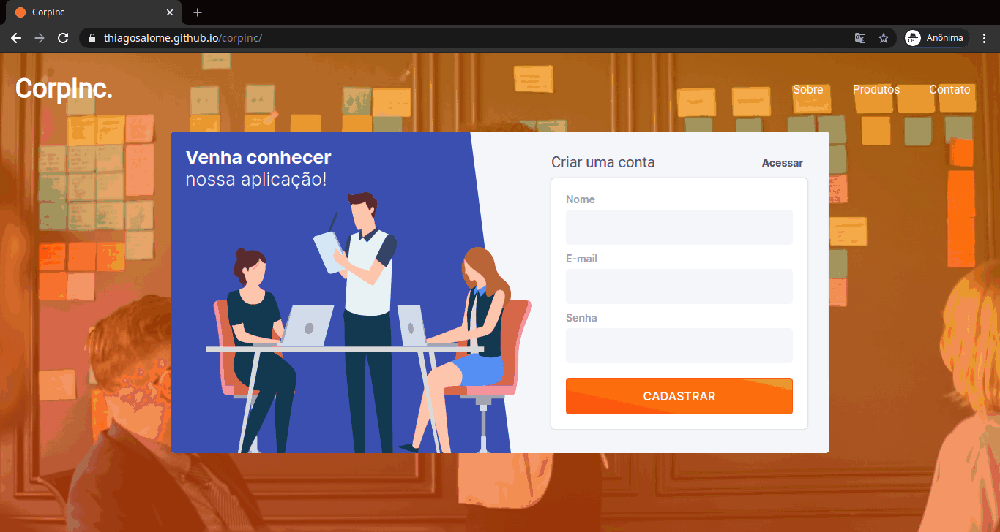

<!-- Logo -->
<h1 align="center">
  
  CorpInc.
</h1>

<!-- Badges -->
<p align="center">
  <a href="https://thiagosalome.github.io/corpinc/" target="_blank">
  </a>
  
  
  
  
</p>

<!-- Indice-->
<p align="center">
 <a href="#computer-sobre">Sobre</a> •
 <a href="#gear-funcionalidades">Funcionalidades</a> •
 <a href="#wrench-tecnologias-utilizadas">Tecnologias</a> •
 <a href="#movie_camera-preview">Preview</a> •
 <a href="#memo-licença">Licença</a>
</p>

## :computer: Sobre

O **CorpInc** foi meu projeto teste no Banco Inter. Foi enriquecedor pelo fato de ser uma das minha primeiras aplicações utilizando React e Strapi.

## :gear: Funcionalidades

- [x] Usuário
  - [x] Criar uma conta
  - [x] Fazer Login
  - [x] Criar uma task
    - [x] Valor da task
    - [x] Observação
  - [x] Visualizar tasks cadastradas

## :wrench: Tecnologias Utilizadas

<table>
  <tbody>
    <tr>
      <td align="center">
        
        <p>HTML</p>
      </td>
      <td align="center">
        
        <p>SASS</p>
      </td>
      <td align="center">
        
        <p>Javascript</p>
      </td>
      <td align="center">
        
        <p>React</p>
      </td>
      <td align="center">
        
        <p>Node.js</p>
      </td>
      <td align="center">
        
        <p>Strapi</p>
      </td>
      <td align="center">
        
        <p>Mongo</p>
      </td>
    </tr>
  </tbody>
</table>

## :movie_camera: Preview

### Desktop



### Mobile


## :rocket: Executando o projeto

### Pré-requisitos

Para executar o projeto é necessário ter instalado as seguintes ferramentas:

<table>
  <tbody>
    <tr>
      <td align="center">
        <a href='https://git-scm.com/downloads' target='_blank'>
          
          <p>GIT</p>
        </a>
      </td>
      <td>
        <a href='https://git-scm.com/downloads' target='_blank'>
          
          <p>Node.js</p>
        </a>
      </td>
    </tr>
  </tbody>
</table>

### Rodando aplicação web

```bash
# Clone este repositório
$ git clone https://github.com/thiagosalome/corpinc

# Acesse a pasta do projeto no seu terminal/cmd
$ cd corpinc

# Instale as dependências
$ npm install

# Execute a aplicação em modo de desenvolvimento
$ npm run start

# A aplicação será aberta na porta:3000 - acesse http://localhost:3000
```

## :memo: Licença

Este projeto esta sobe a licença [MIT](./LICENCE).
